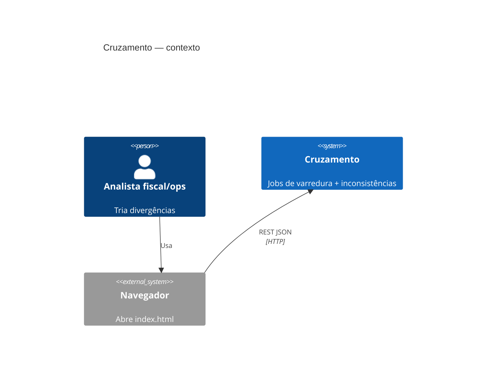
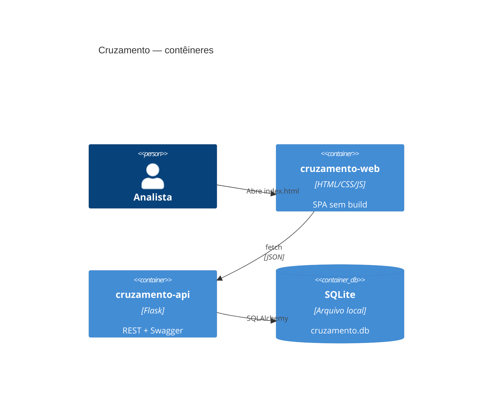
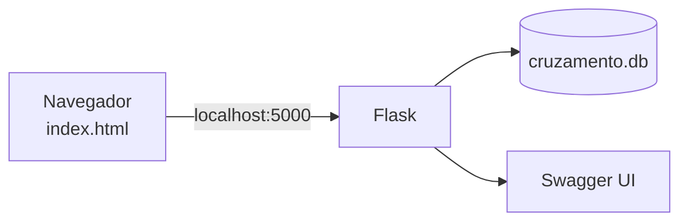

# Arquitetura — Cruzamento

## 1. Visão geral

```
┌─────────────────────────────┐         ┌──────────────────────────────────┐
│  cruzamento-web             │  HTTP   │  cruzamento-api                  │
│  (SPA file:// ou estático)  │ ──────► │  Flask + SQLAlchemy + SQLite     │
│  HTML / CSS / JS / Bootstrap│  JSON   │  Swagger em /api/docs            │
└─────────────────────────────┘         └──────────────────────────────────┘
```

Dois repositórios, um contrato. O repositório atual (`cruzamento`) guarda só a documentação.

## 2. C4 — Contexto



## 3. C4 — Contêineres



## 4. Camadas no back-end

```
cruzamento-api/
  app/
    __init__.py          # factory Flask
    config.py
    extensions.py        # db, cors
    api/                 # blueprints / controllers (adapters)
    schemas/             # serialização / validação de entrada
    services/            # casos de uso (application)
    domain/              # entidades e regras puras
    models/              # mapeamento SQLAlchemy (infra)
    swagger/             # specs ou docstrings flasgger
  tests/
  run.py
  requirements.txt
  README.md
```

Responsabilidades:

| Camada | Pode | Não pode |
|--------|------|----------|
| `api/` | HTTP in/out, status code | Regra de negócio pesada |
| `services/` | Orquestrar UC, transação | Conhecer Flask request |
| `domain/` | Invariantes, transições de status | Importar SQLAlchemy |
| `models/` | Persistência | Decidir regra de fechamento sozinho |

## 5. Camadas no front-end

```
cruzamento-web/
  index.html
  css/
    tokens.css           # design tokens
    base.css
    components.css
    layouts.css
  js/
    config.js            # BASE_URL da API
    api/client.js        # fetch wrapper
    api/jobs.js
    api/inconsistencias.js
    state.js             # estado mínimo em memória
    views/               # render de cada tela
    app.js               # router hash (#/jobs, #/inconsistencias/1)
  README.md
```

Roteamento por `location.hash` — atende “SPA” sem framework.

## 6. Restrições REST mapeadas

| Restrição Fielding | Como aparece no Cruzamento |
|--------------------|----------------------------|
| Separação client/server | Repos e processos distintos |
| Interface uniforme | Recursos `/api/jobs`, `/api/inconsistencias` |
| Stateless | Sem sessão server-side |
| Camadas | api → service → domain → model |
| Code on demand | Scripts JS carregados pela página |

## 7. Endpoints (contrato alvo)

| Método | Path | RF |
|--------|------|----|
| POST | `/api/jobs` | RF-01 |
| GET | `/api/jobs` | RF-02 |
| GET | `/api/jobs/{id}` | RF-03 |
| POST | `/api/jobs/{id}/executar` | RF-04 |
| DELETE | `/api/jobs/{id}` | RF-05 |
| GET | `/api/inconsistencias` | RF-06 |
| POST | `/api/inconsistencias` | RF-07 |
| GET | `/api/inconsistencias/{id}` | RF-08 |
| PATCH | `/api/inconsistencias/{id}` | RF-09 |
| POST | `/api/inconsistencias/{id}/comentarios` | RF-10 |
| DELETE | `/api/inconsistencias/{id}` | RF-11 |
| GET | `/api/docs` | RF-13 |
| POST | `/api/dev/seed` | RF-14 (dev) |

## 8. Diagrama de deploy (local)



Porta padrão da API: `5000` (configurável). Front aponta `config.js` para essa base.
