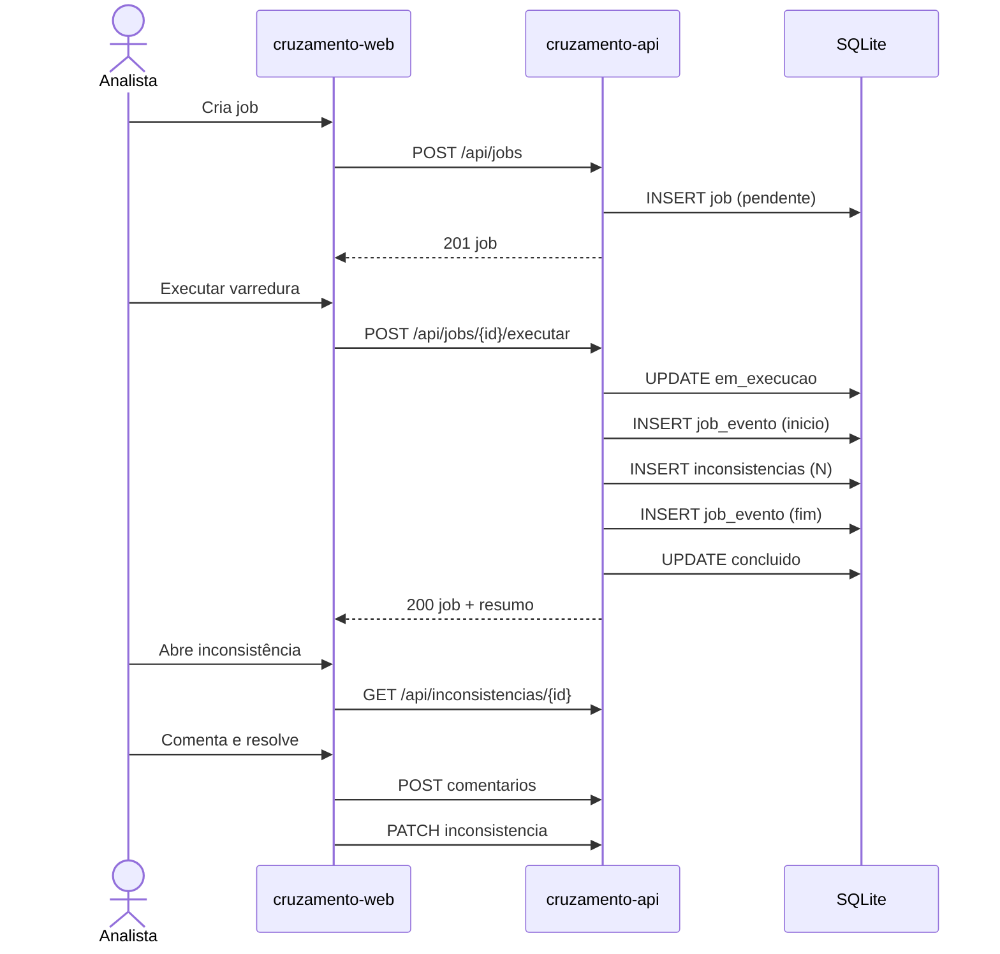

# System design — Cruzamento

Documento de decisões de produto/técnicas em nível de sistema. Detalhes pontuais ficam nos ADRs.

---

## 1. O que o sistema é (e não é)

**É:** um CRUD orquestrado com um caso de uso central — *executar varredura* — que materializa inconsistências.

**Não é:** motor fiscal, motor de regras SPED, orquestrador de workers em produção.

## 2. Fluxo crítico

## 3. Modelo de consistência

- Transação única por `executar`: ou grava eventos + inconsistências + status final, ou rollback.
- Comentários só existem com inconsistência pai.
- Exclusão de inconsistência remove comentários (cascade).
- Política de exclusão de job: [ADR-002](adrs/002-exclusao-job.md).

## 4. Simulação da varredura

No MVP, “executar” **não lê arquivo fiscal**. Gera inconsistências a partir de um gerador determinístico/pseudoaleatório controlado por seed (competência + id do job), para demo estável.

Parâmetros:

| Parâmetro | Default | Onde |
|-----------|---------|------|
| `quantidade` | 3 | body opcional do POST executar |
| tipos possíveis | divergencia_valor, cnpj_invalido, campo_obrigatorio | domínio |
| severidades | baixa, media, alta | domínio |

## 5. Capacidade e limites

| Dimensão | Limite MVP |
|----------|------------|
| Jobs | dezenas |
| Inconsistências | centenas |
| Concorrência | 1 usuário local |
| Tamanho payload | < 100 KB |

SQLite basta. Se um dia migrar, o domínio não muda — só `models/` e config.

## 6. Tratamento de erro

| Situação | Resposta |
|----------|----------|
| Validação | 400 + `{ "erro": "...", "campos": {} }` |
| Não encontrado | 404 + `{ "erro": "..." }` |
| Conflito de estado | 409 |
| Bug não tratado | 500 + mensagem genérica; detalhe no log |

Front: toast/banner; não engolir falha de rede.

## 7. Segurança (realista para o escopo)

Ameaça real em produção (auth, IDOR, etc.) **fora do MVP**. Ainda assim:

- validar enums;
- limitar tamanho de texto (parecer/comentário);
- não expor stack trace no JSON de produção (`FLASK_DEBUG=0`).

## 8. Evolução possível (pós-MVP, não implementar agora)

1. Job assíncrono com status polling.
2. Auth JWT e papéis (analista / revisor).
3. Anexos (evidências).
4. Export CSV das inconsistências abertas.
5. Webhook “job concluído”.

Essas setas existem para mostrar system design consciente — não entram na entrega da disciplina.
