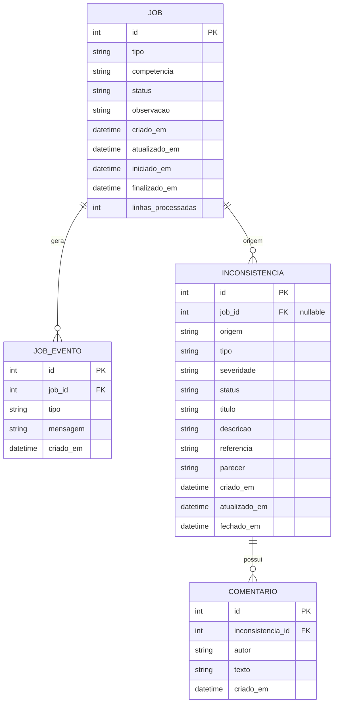

# Modelagem de dados — Blind Spot

## 1. Diagrama entidade-relacionamento

## 2. Dicionário de dados

### job

| Coluna | Tipo | Nulo | Descrição |
|--------|------|------|-----------|
| id | INTEGER PK | não | Surrogate |
| tipo | VARCHAR(40) | não | Ex.: `varredura_divergencias` |
| competencia | VARCHAR(20) | não | Ex.: `2026-07` |
| status | VARCHAR(20) | não | Ver enums |
| observacao | TEXT | sim | Livre |
| criado_em | DATETIME | não | UTC ou local documentado |
| atualizado_em | DATETIME | não | |
| iniciado_em | DATETIME | sim | Preenchido na execução |
| finalizado_em | DATETIME | sim | |
| linhas_processadas | INTEGER | não | Default 0 |

**Status:** `pendente` | `em_execucao` | `concluido` | `falha` | `cancelado`

### job_evento

| Coluna | Tipo | Nulo | Descrição |
|--------|------|------|-----------|
| id | INTEGER PK | não | |
| job_id | INTEGER FK | não | Cascade delete com job quando permitido |
| tipo | VARCHAR(30) | não | `inicio`, `progresso`, `fim`, `erro` |
| mensagem | TEXT | não | |
| criado_em | DATETIME | não | |

### inconsistencia

| Coluna | Tipo | Nulo | Descrição |
|--------|------|------|-----------|
| id | INTEGER PK | não | |
| job_id | INTEGER FK | sim | Nulo se origem manual |
| origem | VARCHAR(20) | não | `job` \| `manual` |
| tipo | VARCHAR(40) | não | Enum de tipos |
| severidade | VARCHAR(10) | não | `baixa` \| `media` \| `alta` |
| status | VARCHAR(20) | não | Ver abaixo |
| titulo | VARCHAR(120) | não | |
| descricao | TEXT | não | |
| referencia | VARCHAR(80) | sim | Ex.: doc/chave fictícia |
| parecer | TEXT | sim | Obrigatório ao fechar |
| criado_em | DATETIME | não | |
| atualizado_em | DATETIME | não | |
| fechado_em | DATETIME | sim | |

**Status:** `aberta` | `em_analise` | `resolvida` | `descartada`

### comentario

| Coluna | Tipo | Nulo | Descrição |
|--------|------|------|-----------|
| id | INTEGER PK | não | |
| inconsistencia_id | INTEGER FK | não | ON DELETE CASCADE |
| autor | VARCHAR(80) | não | Texto livre no MVP |
| texto | TEXT | não | 1..2000 chars |
| criado_em | DATETIME | não | |

## 3. Índices

- `job(status)`, `job(criado_em DESC)`
- `inconsistencia(status)`, `inconsistencia(job_id)`, `inconsistencia(criado_em DESC)`
- `comentario(inconsistencia_id, criado_em)`

## 4. Regras de integridade (domínio)

1. Se `origem = job`, `job_id` é obrigatório.
2. Se `origem = manual`, `job_id` deve ser nulo.
3. Transição de inconsistência para `resolvida`/`descartada` exige `parecer` com ≥ 10 caracteres.
4. Job só executa se status ∈ {`pendente`, `falha`} (reexecução limpa eventos anteriores — ADR-003).
5. Não existe comentário órfão.

## 5. Exemplos de registro (seed)

**Job:** tipo `varredura_divergencias`, competência `2026-07`, status `concluido`, linhas 3.

**Inconsistências:**
1. `divergencia_valor` / alta — “Valor do documento difere do livro”
2. `cnpj_invalido` / media — “CNPJ com tamanho insuficiente”
3. `campo_obrigatorio` / baixa — “Município de prestação ausente”

Dados 100% fictícios.
