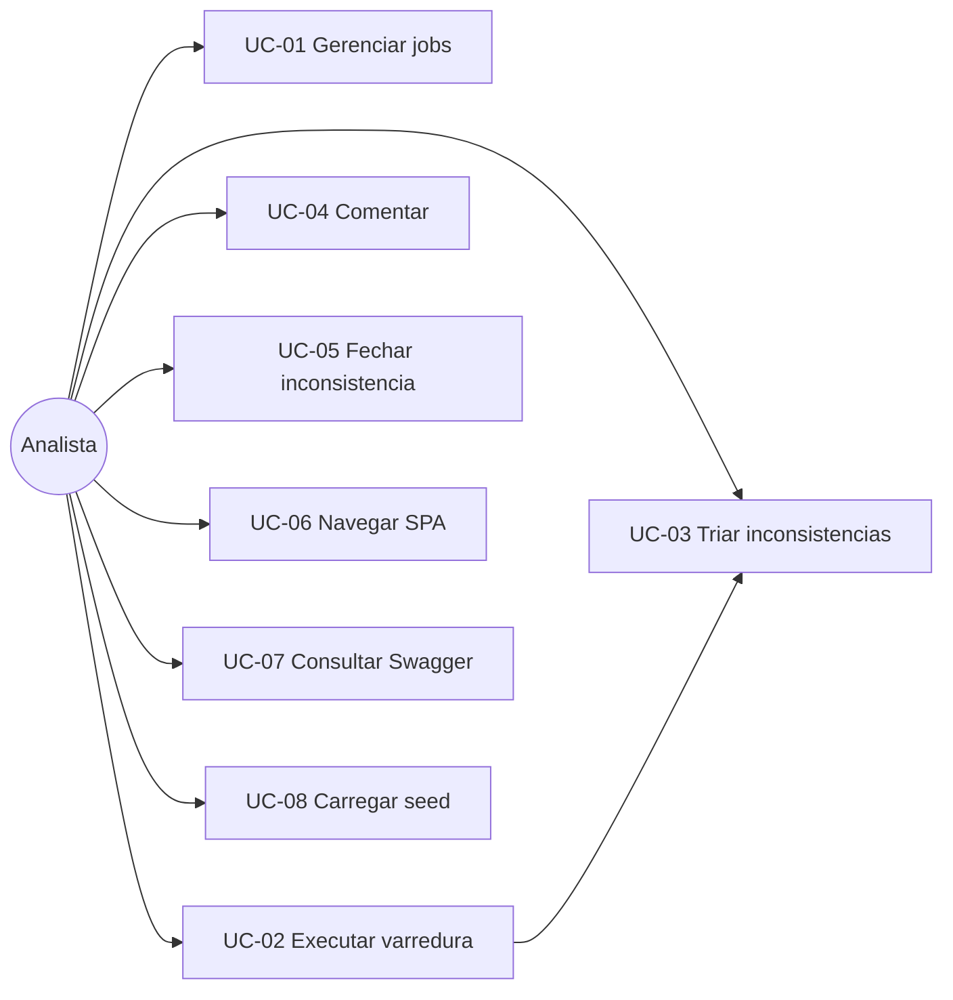

# Casos de uso — Cruzamento

## 1. Atores

| Ator | Tipo | Descrição |
|------|------|-----------|
| Analista | Primário | Usa o SPA para jobs e triagem |
| Sistema | Interno | Regras de execução e validação |
| Avaliador | Secundário | Consome Swagger e vídeo (fora do software) |

## 2. Diagrama de casos de uso

## 3. Especificações

### UC-01 — Gerenciar jobs

- **Ator:** Analista  
- **Pré-condição:** API no ar  
- **Fluxo principal:**
  1. Acessa visão Jobs.
  2. Preenche tipo, competência, observação.
  3. Sistema valida e persiste (`pendente`).
  4. Lista atualiza com o novo card.
- **Alternativo:** validação falha → mensagem no formulário.
- **Pós-condição:** job persistido.

### UC-02 — Executar varredura

- **Pré-condição:** job `pendente` ou `falha`  
- **Fluxo principal:**
  1. Analista clica Executar.
  2. Sistema grava eventos, cria inconsistências, marca `concluido`.
  3. UI mostra resumo (N geradas).
- **Alternativo:** job em estado inválido → 409.
- **Pós-condição:** inconsistências listáveis com `job_id`.

### UC-03 — Triar inconsistências

- **Fluxo:** listar → filtrar por status/job → abrir detalhe.
- **Pós:** inconsistência em `em_analise` se analista avançar status.

### UC-04 — Comentar

- **Fluxo:** no detalhe, informar autor + texto → gravar → aparecer na timeline.

### UC-05 — Fechar inconsistência

- **Pré:** status `aberta` ou `em_analise`  
- **Fluxo:** informar parecer → status `resolvida` ou `descartada` → `fechado_em` preenchido.
- **Alternativo:** parecer curto demais → 400.

### UC-06 — Navegar SPA

Hash routes: `#/jobs`, `#/jobs/:id`, `#/inconsistencias`, `#/inconsistencias/:id`. Sem reload full page.

### UC-07 — Consultar Swagger

Analista/avaliador abre `/api/docs` e exercita rotas.

### UC-08 — Carregar seed

Ambiente local: `POST /api/dev/seed` (ou CLI) popula demo idempotente para o vídeo.

## 4. Matriz ator × UC

| | UC01 | UC02 | UC03 | UC04 | UC05 | UC06 | UC07 | UC08 |
|--|:----:|:----:|:----:|:----:|:----:|:----:|:----:|:----:|
| Analista | X | X | X | X | X | X | X | X |
