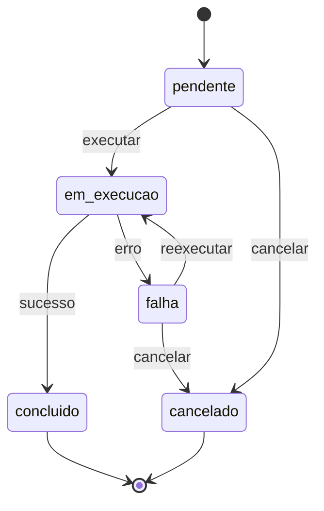
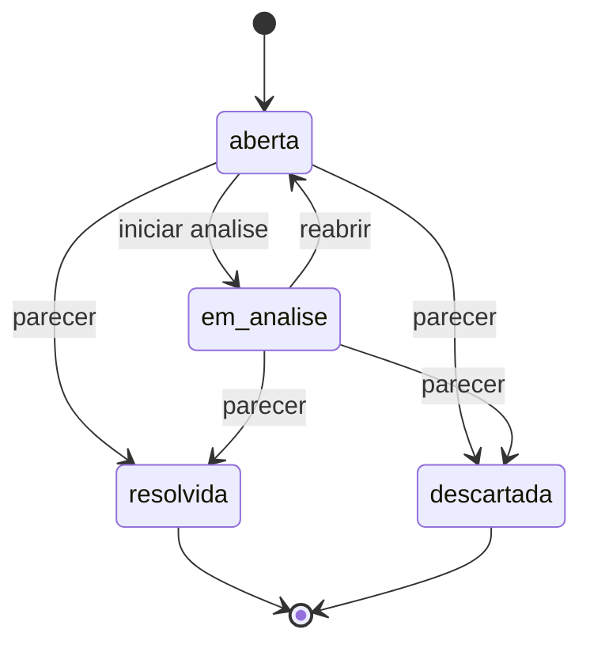

# Máquinas de estado

## Job

```mermaid
stateDiagram-v2
  [*] --> pendente
  pendente --> em_execucao: executar
  pendente --> cancelado: cancelar
  em_execucao --> concluido: sucesso
  em_execucao --> falha: erro
  falha --> em_execucao: reexecutar
  falha --> cancelado: cancelar
  concluido --> [*]
  cancelado --> [*]
```

## Inconsistência

```mermaid
stateDiagram-v2
  [*] --> aberta
  aberta --> em_analise: iniciar analise
  aberta --> resolvida: parecer
  aberta --> descartada: parecer
  em_analise --> resolvida: parecer
  em_analise --> descartada: parecer
  em_analise --> aberta: reabrir
  resolvida --> [*]
  descartada --> [*]
```
