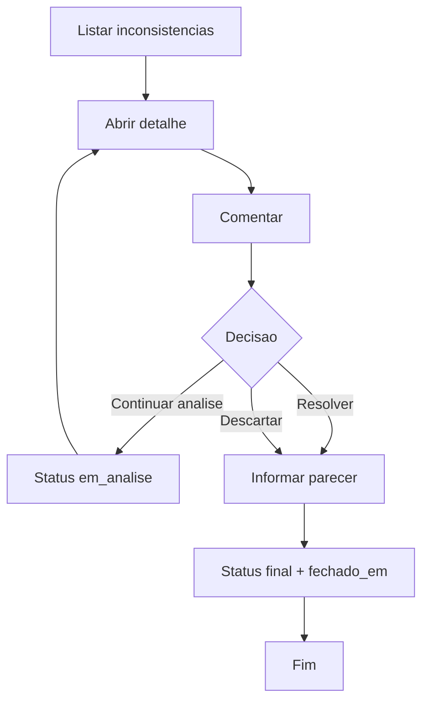

# Fluxo — triagem

```mermaid
flowchart TD
  A[Listar inconsistencias] --> B[Abrir detalhe]
  B --> C[Comentar]
  C --> D{Decisao}
  D -->|Continuar analise| E[Status em_analise]
  E --> B
  D -->|Resolver| F[Informar parecer]
  D -->|Descartar| F
  F --> G[Status final + fechado_em]
  G --> H[Fim]
```
