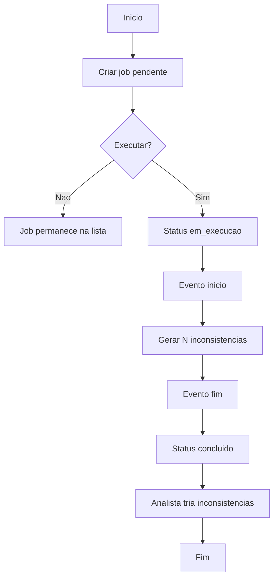

# Fluxo — varredura

```mermaid
flowchart TD
  A[Inicio] --> B[Criar job pendente]
  B --> C{Executar?}
  C -->|Nao| D[Job permanece na lista]
  C -->|Sim| E[Status em_execucao]
  E --> F[Evento inicio]
  F --> G[Gerar N inconsistencias]
  G --> H[Evento fim]
  H --> I[Status concluido]
  I --> J[Analista tria inconsistencias]
  J --> K[Fim]
```
