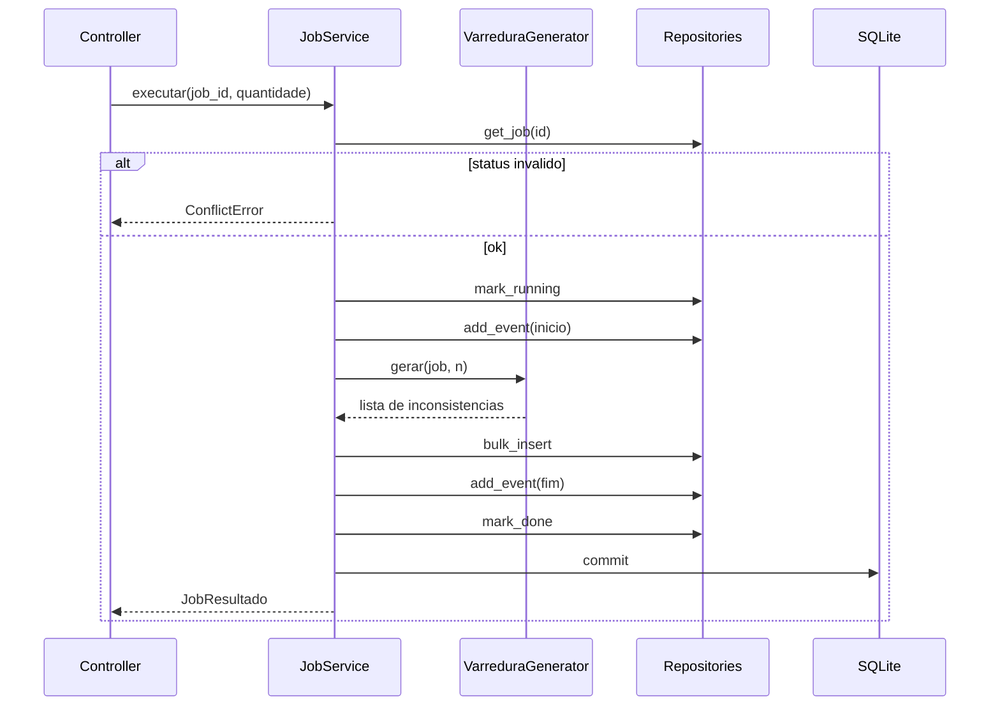

# Sequência — executar varredura

```mermaid
sequenceDiagram
    participant C as Controller
    participant S as JobService
    participant G as VarreduraGenerator
    participant R as Repositories
    participant DB as SQLite

    C->>S: executar(job_id, quantidade)
    S->>R: get_job(id)
    alt status invalido
        S-->>C: ConflictError
    else ok
        S->>R: mark_running
        S->>R: add_event(inicio)
        S->>G: gerar(job, n)
        G-->>S: lista de inconsistencias
        S->>R: bulk_insert
        S->>R: add_event(fim)
        S->>R: mark_done
        S->>DB: commit
        S-->>C: JobResultado
    end
```
